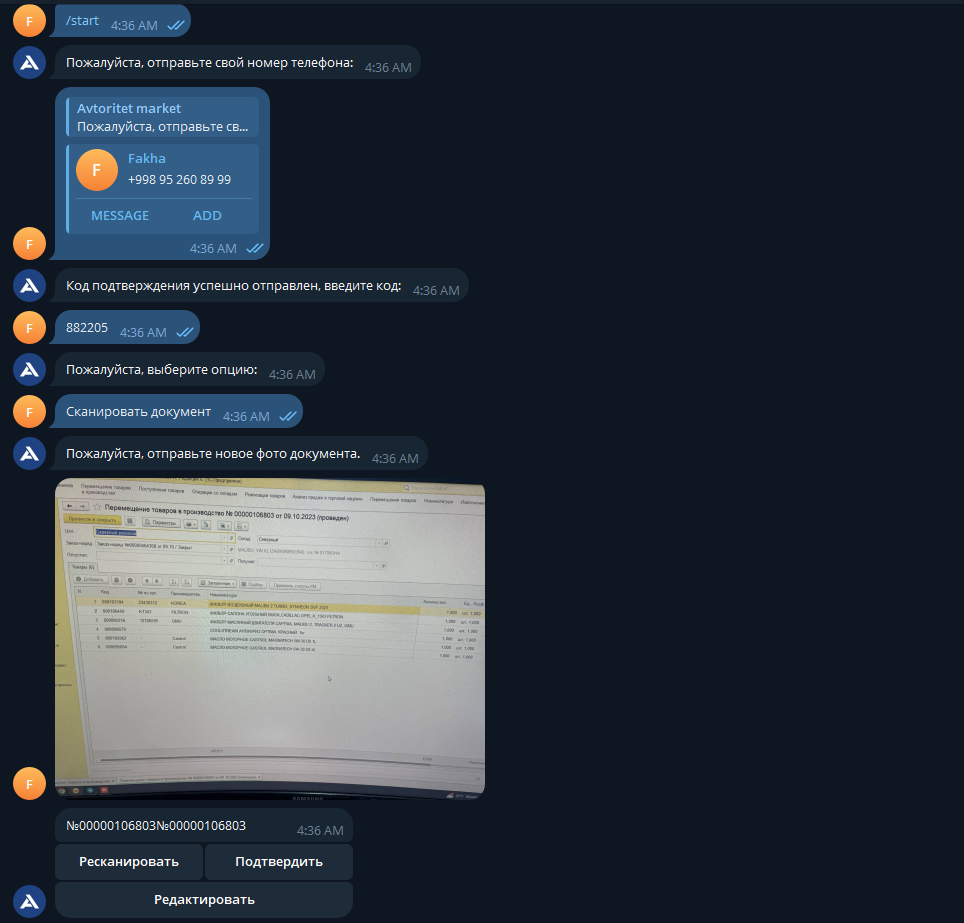
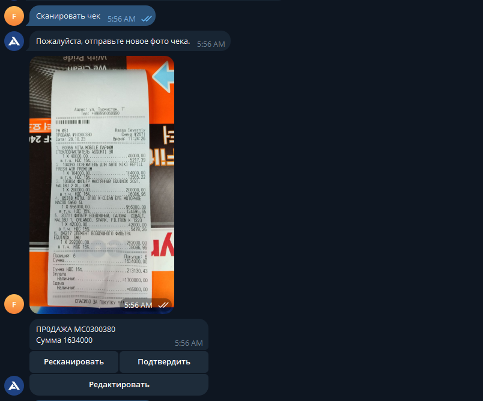

# Receipt Scanner Bot

This project is a Python-based Telegram bot - designed to scan and interpret receipts and documents using the Google Cloud Vision API. It also integrates with a Django backend for authentication, Eskiz SMS to get verification code, and Redis for caching user sessions.

## Features

- **Google Cloud Vision API**: Extracts and analyzes text from uploaded images, such as receipts and documents.
- **Telegram Bot**: User-friendly interaction for scanning and managing receipts via Telegram.
- **Django API Integration**: Communicates with a Django backend for user authentication and data validation.
- **Eskiz SMS API**: Sends SMS notifications and verification codes.
- **Redis**: Used for caching user sessions and managing temporary states.

## Installation

### Prerequisites

- Python 3.x
- [Google Cloud Vision API](https://cloud.google.com/vision/docs/setup) credentials
- Telegram Bot token
- Eskiz SMS API credentials
- Redis

### Setup

1. **Clone the repository**:

   ```bash
   git clone https://github.com/Fakhrillo/Receipt_TgBot.git
   cd Receipt_TgBot
   ```

Create .env and add necessary environment variables

2. **Create a virtual environment to install dependencies in and activate it**:

```sh
$ python3 -m venv env (python on Windows)
$ source env/bin/activate (env\Scripts\activate on Windows)
```

3. **Then install the dependencies**:

```sh
(env)$ pip install -r requirements.txt
```

4. **Run Redis (if not already running)**:

```sh
redis-server
```

5. **Start the bot**:
```sh
python checkbot_russian.py
```

## Usage

Once the bot is running, users can interact with it through Telegram to:

- Scan Receipts: Upload an image of a receipt, and the bot will extract and return the text.
- Scan Documents: Similarly, users can upload documents for text extraction.


# Live Preview




## License
This project is licensed under the MIT License. See the LICENSE file for details.
